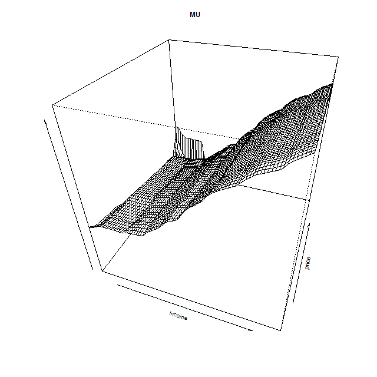
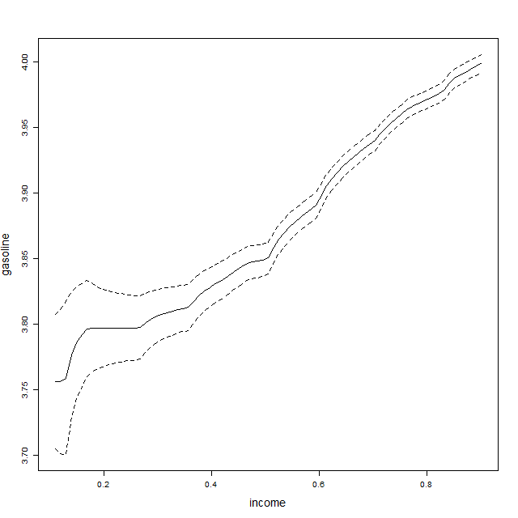
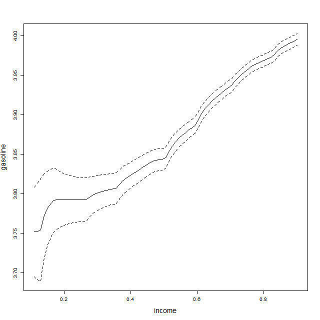
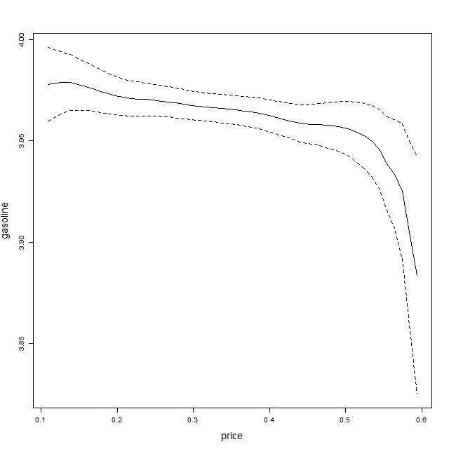
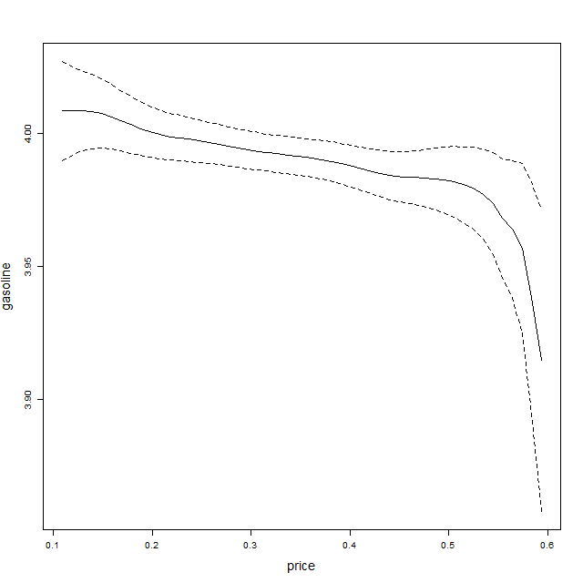

[](http://quantlet.de/index.php?p=info)

## [](http://quantlet.de/) **EIV_UCS** [](http://quantlet.de/d3/ia)

```yaml

Name of QuantLet : EIV_UCS

Published in : EIV_UCS

Description : 'Performs bivariate kernel smoothed regression and bootstrapped confidence bands for
gasoline demand on personal income and gasoline price.'

Keywords : bootstrap, error, kernel, confidence-bands, conditional mean

Author [New] : Kun Ho Kim

Author : Shih-Kang Chao

Submitted : Thu, July 21 2016 by Chen Huang

Datafile : EIV_UCS_data.txt

Example : Some plots of confidence bands for gasoline price and gasoline demand on personal income.

```














### R Code:
```r

## clear history
rm(list = ls(all = TRUE))
graphics.off()

## install and load packages
libraries = c("MASS", "KernSmooth", "quantreg")
lapply(libraries, function(x) if (!(x %in% installed.packages())) {
  install.packages(x)
})
lapply(libraries, library, quietly = TRUE, character.only = TRUE)

## read data
data0 = read.table("EIV_UCS_data.txt", header = T)

data0$HHCHILD1 = 1 * (data0$HHCHILD == 1)
data0$HHCHILD2 = 1 * (data0$HHCHILD == 2)
data0$HHCHILD3 = 1 * (data0$HHCHILD == 3)
data0$HHCHILD4 = 1 * (data0$HHCHILD == 4)
data0$HHCHILD5 = 1 * (data0$HHCHILD == 5)
data0$HHCHILD6 = 1 * (data0$HHCHILD == 6)
data0$HHCHILD7 = 1 * (data0$HHCHILD == 7)
data0$HHCHILD8 = 1 * (data0$HHCHILD == 8)
data0$HHCHILD9 = 1 * (data0$HHCHILD == 9)

data0$CENSUS1 = 1 * (data0$HHCHILD == 1)
data0$CENSUS2 = 1 * (data0$HHCHILD == 2)
data0$CENSUS3 = 1 * (data0$HHCHILD == 3)
data0$CENSUS4 = 1 * (data0$HHCHILD == 4)
data0$CENSUS5 = 1 * (data0$HHCHILD == 5)
data0$CENSUS6 = 1 * (data0$HHCHILD == 6)
data0$CENSUS7 = 1 * (data0$HHCHILD == 7)
data0$CENSUS8 = 1 * (data0$HHCHILD == 8)
data0$CENSUS9 = 1 * (data0$HHCHILD == 9)

data1 = data0[(data0$AVGVEHS != 0) & (data0$HHINCOME != -9) & (data0$TOTGALS != 0) & (data0$DRVRCNTC != 
    0) & (data0$TOTMILES != 0), ]
data1$HHINCOME[data1$HHINCOME == 1] = 2500
data1$HHINCOME[data1$HHINCOME == 2] = 7500
data1$HHINCOME[data1$HHINCOME == 3] = 12500
data1$HHINCOME[data1$HHINCOME == 4] = 17500
data1$HHINCOME[data1$HHINCOME == 5] = 22500
data1$HHINCOME[data1$HHINCOME == 6] = 30000
data1$HHINCOME[data1$HHINCOME == 7] = 42500
data1$HHINCOME[data1$HHINCOME == 8] = 62500
data1$HHINCOME[data1$HHINCOME == 9] = 1e+05

data2          = log10(data1)
data2$HHR_SEX  = data1$HHR_SEX - 1  # gender
data2$URBRUR   = data1$URBRUR - 1    # urban
data2$HHCOMP   = data1$HHCOMP        # child
data2$HHCHILD1 = data1$HHCHILD1
data2$HHCHILD2 = data1$HHCHILD2
data2$HHCHILD3 = data1$HHCHILD3
data2$HHCHILD4 = data1$HHCHILD4
data2$HHCHILD5 = data1$HHCHILD5
data2$HHCHILD6 = data1$HHCHILD6
data2$HHCHILD7 = data1$HHCHILD7
data2$HHCHILD8 = data1$HHCHILD8
data2$HHCHILD9 = data1$HHCHILD9

data2$CENSUS1  = data1$CENSUS1
data2$CENSUS2  = data1$CENSUS2
data2$CENSUS3  = data1$CENSUS3
data2$CENSUS4  = data1$CENSUS4
data2$CENSUS5  = data1$CENSUS5
data2$CENSUS6  = data1$CENSUS6
data2$CENSUS7  = data1$CENSUS7
data2$CENSUS8  = data1$CENSUS8
data2$CENSUS9  = data1$CENSUS9
data           = data2[1:floor(dim(data2)[1]), ]

## functions 
Kerft = function(y, ker.name) {
    # function to compute kernel value at y
    if (ker.name == "Epan") {
        res = (3/4) * (1 - y^2) * ((1 - y^2) > 0)
    } else {
        # if gaussian
        res = dnorm(y)
    }
    return(res)
}

gcv.ft = function(y, x, bn) {
    gcv = array(0, length(bn))
    for (bni in 1:length(bn)) {
        numer = array(0, size.data[1])
        deno  = array(0, size.data[1])
        for (i in 1:size.data[1]) {
            print(i)
            zi.s        = (matrix(1, size.data[1], 1) %*% x[i, ] - x)/bn[bni]
            ker.zi      = cbind(Kerft(zi.s[, 1], ker.name = ker), Kerft(zi.s[, 2], ker.name = ker))
            prod.ker.zi = apply(ker.zi, 1, FUN = prod)
            numer[i]    = sum(y * prod.ker.zi)
            deno[i]     = 1/sum(prod.ker.zi)
        }
        gcv[bni] = mean((y - as.matrix(numer * deno))^2)/(1 - (3/4) * mean(deno))^2
    }
    return(gcv)
}

gcv2.ft = function(y, x, bn) {
    gcv2 = array(0, length(bn))
    for (bni in 1:length(bn)) {
        deno  = array(0, size.data[1])
        fhat  = array(0, c(size.data[1], dim(y)[2]))
        resid = array(0, c(size.data[1], dim(y)[2]))
        for (i in 1:size.data[1]) {
            print(i)
            zi.s        = (matrix(1, size.data[1], 1) %*% x[i, ] - x)/bn[bni]
            ker.zi      = cbind(Kerft(zi.s[, 1], ker.name = ker), Kerft(zi.s[, 2], ker.name = ker))
            prod.ker.zi = apply(ker.zi, 1, FUN = prod)
            deno[i]     = 1/sum(prod.ker.zi)
            for (j in 1:dim(y)[2]) {
                fhat[i, j] = sum(y[, j] * prod.ker.zi) * deno[i]
            }
            resid[i, ] = as.numeric(y[i, ]) - as.numeric(fhat[i, ])
        }
        gcv2[bni] = mean((resid)^2)/(1 - 15 * (3/4) * mean(deno))^2
    }
    return(gcv2)
}

## repsonse var.: 'y'
tmp.yi = data$TOTMILES

## [log(income); log(price)]:
tmp.zi = cbind(data$HHINCOME, log10(data1$TOTCOST[1:floor(dim(data1)[1])]/data1$TOTGALS[1:floor(dim(data1)[1])]))
cutoff = 0.01

## income and price variables
sub.zi = tmp.zi[tmp.zi[, 2] > cutoff, ]

## yi=dependent var.
yi        = tmp.yi[tmp.zi[, 2] > cutoff]
size.data = length(yi)
max.zi    = apply(sub.zi, c(2), FUN = max)
min.zi    = apply(sub.zi, c(2), FUN = min)
const     = 1
zi        = const * (sub.zi - matrix(1, size.data, 1) %*% min.zi)/matrix(1, size.data, 1) %*% 
    (max.zi - min.zi)

## covariates for the "linear" part 
# 2: log of number of vehicle (AVGVEHS)  
# 5: log of number of Drivers (DRVRCNTC)  
# 7: child dummy (HHCOMP)  
# 9: gender dummy (HHR_SEX) 
# 10: log of family size (HHSIZEC) 
# 16: urban dummy (URBRUR) 
# 26-34: CENSUS1-CENSUS9 dummies
xi  = data[tmp.zi[, 2] > cutoff, c(2, 5, 7, 9, 10, 16, 26:34)]
ker = "Epan"

## gcv (y = yi; x = zi) for "ghat"
# bn      = seq(0.01, 0.40, by = 0.01)
# gcv.obj = gcv.ft(yi, zi, bn)
# which.min(gcv.obj)

## cv (y=xi; x=zi) for "fhat"
# bn       = seq(0.01, 0.40, by = 0.01)
# gcv.obj2 = gcv2.ft(xi, zi, bn)
# which.min(gcv.obj2)

## estimate g(.) and f(.)
bn   = 0.04  # GCV-chosen bandwidth for 'ghat'
hn   = 0.32  # GCV-chosen bandwidth for 'fhat'
ghat = array(0, size.data[1])
fhat = array(0, c(size.data[1], dim(xi)[2]))
yi.s = array(0, size.data[1])
xi.s = array(0, c(size.data[1], dim(xi)[2]))
for (i in 1:size.data[1]) {
    print(i)
    zi.s         = (matrix(1, size.data[1], 1) %*% zi[i, ] - zi)/bn
    ker.zi       = cbind(Kerft(zi.s[, 1], ker.name = ker), Kerft(zi.s[, 2], ker.name = ker))
    prod.ker.zi  = apply(ker.zi, 1, FUN = prod)  #K(.)*K(.)
    ghat[i]      = sum(yi * prod.ker.zi)/sum(prod.ker.zi)
    zi.s2        = (matrix(1, size.data[1], 1) %*% zi[i, ] - zi)/hn
    ker.zi2      = cbind(Kerft(zi.s2[, 1], ker.name = ker), Kerft(zi.s2[, 2], ker.name = ker))
    prod.ker.zi2 = apply(ker.zi2, 1, FUN = prod)
    for (j in 1:dim(xi)[2]) {
        fhat[i, j] = sum(xi[, j] * prod.ker.zi2)/sum(prod.ker.zi2)
    }
    yi.s[i]   = yi[i] - ghat[i]
    xi.s[i, ] = as.numeric(xi[i, ]) - as.numeric(fhat[i, ])
}

## Robinson estimate
beta.hat = ginv(t(as.matrix(xi.s)) %*% as.matrix(xi.s)) %*% (t(as.matrix(xi.s)) %*% as.matrix(yi.s, 
    size.data[1], 1))

## gcv for \hat{mu(.)} 
# bn       = seq(0.10, 0.60, by = 0.01)
# gcv.obj3 = gcv.ft(yi - as.matrix(xi) %*% beta.hat, zi, bn)
# which.min(gcv.obj3)

bn       = 0.17  # GCV-chosen bandwidth
n3       = size.data[1]
jdensity = (1/(n3 * bn^2)) * sum(prod.ker.zi)
yi.t     = yi - as.matrix(xi) %*% beta.hat
n.x      = 101
disc     = 5
xvec     = seq(disc * const/n.x, 1 - disc * const/n.x, by = const/n.x)
mu.hat   = matrix(0, length(xvec), length(xvec))
zi.den   = matrix(0, length(xvec), length(xvec))

## \hat\mu(.)
for (i in 1:length(xvec)) {
    for (j in 1:length(xvec)) {
        xvec.ij      = t(as.matrix(c(xvec[i], xvec[j])))
        print(c(i, j))
        zi.s         = (matrix(1, size.data[1], 1) %*% xvec.ij - zi)/bn
        ker.zi       = cbind(Kerft(zi.s[, 1], ker.name = ker), Kerft(zi.s[, 2], ker.name = ker))
        prod.ker.zi  = apply(ker.zi, 1, FUN = prod)
        mu.hat[i, j] = as.numeric(sum(yi.t * prod.ker.zi)/sum(prod.ker.zi))
        zi.den[i, j] = as.numeric(sum(prod.ker.zi)/(size.data[1] * bn^2))
    }
}
mu.hat2 = array(0, size.data[1])
for (i in 1:size.data[1]) {
    print(i)
    zi.s        = (matrix(1, size.data[1], 1) %*% zi[i, ] - zi)/bn
    ker.zi      = cbind(Kerft(zi.s[, 1], ker.name = ker), Kerft(zi.s[, 2], ker.name = ker))
    prod.ker.zi = apply(ker.zi, 1, FUN = prod)
    mu.hat2[i]  = as.numeric(sum(yi.t * prod.ker.zi)/sum(prod.ker.zi))
}

## sig^2 estimate
eps.i      = as.numeric(yi.t) - as.numeric(mu.hat2)
sigma2.hat = matrix(0, length(xvec), length(xvec))
for (i in 1:length(xvec)) {
    for (j in 1:length(xvec)) {
        xvec.ij          = t(as.matrix(c(xvec[i], xvec[j])))
        print(c(i, j))
        sigma2.hat[i, j] = as.numeric(sum(eps.i^2 * prod.ker.zi)/sum(prod.ker.zi))
    }
}

## Simulation-based UCB
tmp    = 4 * log(1/bn)
dn     = sqrt(tmp) + (1/sqrt(tmp)) * ((1/2) * log(log(1/bn)) + log((2/pi) * sqrt((25/16)/(2 * 
    pi))))
mn     = ceiling(1/bn)
dn2    = sqrt(4 * log(mn)) - (0.5 * log(2 * log(mn)) + log(2 * sqrt(pi)))/sqrt(4 * log(mn))
k      = 10000
sup.zi = apply(matrix(abs(rnorm(mn * k)), mn, k), c(2), max)
qstar  = quantile(sup.zi, prob = 0.95)
qstar2 = (qstar - dn2) * sqrt(2 * log(mn))
ucb    = (sqrt(sigma2.hat * (0.6)^2/(size.data[1] * bn^2))/sqrt(zi.den)) * (dn + qstar2/sqrt(tmp))
UB     = mu.hat + ucb
LB     = mu.hat - ucb

## Figures 

## 3-D figure
range1 = 7:87  # income: matching index 
range2 = 7:56  # price: matching index
minz   = min(mu.hat[range1, range2])
maxz   = max(mu.hat[range1, range2])
# pdf(file = '3D_0701.pdf', width = 10, height = 10)
par(cex = 0.8)
persp(xvec[range1], xvec[range2], mu.hat[range1, range2], theta = 20, phi = 35, xlab = "income", 
    ylab = "price", zlab = "", main = "MU", zlim = c(minz, maxz))
# dev.off()

## price-gasoline demand
temp.q = quantile(zi[, 1], prob = c(0.25, 0.5, 0.75))
which.min(abs(temp.q[1] - xvec))
which.min(abs(temp.q[2] - xvec))
which.min(abs(temp.q[3] - xvec))
# i = 64  # 25th quantile of "income"
# i = 74  # median income
# i = 84  # 75th income

i = 84
range = 7:56  # price range on the x-axis
miny = min(LB[i, range], mu.hat[i, range], UB[i, range])
maxy = max(LB[i, range], mu.hat[i, range], UB[i, range])
# pdf(file='price_gas_i75_0701.pdf',width=10,height=10)
par(cex = 0.8, cex.lab = 1.5)
plot(xvec[range], mu.hat[i, range], type = "l", ylim = c(miny, maxy), lwd = 1.8, xlab = "price", 
    ylab = "gasoline")
lines(xvec[range], UB[i, range], lty = 2, lwd = 1.8)
lines(xvec[range], LB[i, range], lty = 2, lwd = 1.8)
# dev.off()

## income-gasoline demand
temp.q = quantile(zi[, 2], prob = c(0.25, 0.5, 0.75))
which.min(abs(temp.q[1] - xvec))
which.min(abs(temp.q[2] - xvec))
which.min(abs(temp.q[3] - xvec))
# i = 23  # 25th quantile of "price"
# i = 29  # 50th quantile of "price"
# i = 35  # 75th quantile of "price"

i = 35
range = 7:87  # income range on the x-axis
miny = min(LB[range, i], mu.hat[range, i], UB[range, i])
maxy = max(LB[range, i], mu.hat[range, i], UB[range, i])
# pdf(file = 'inc_gas_p75_0701.pdf', width = 10, height = 10)
par(cex = 0.8, cex.lab = 1.5)
plot(xvec[range], mu.hat[range, i], type = "l", ylim = c(miny, maxy), lwd = 1.8, xlab = "income", 
    ylab = "gasoline")
lines(xvec[range], UB[range, i], lty = 2, lwd = 1.8)
lines(xvec[range], LB[range, i], lty = 2, lwd = 1.8)
# dev.off()

```
